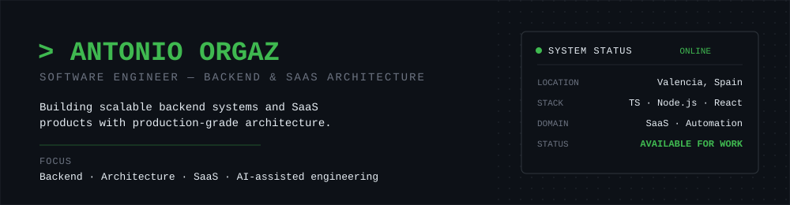
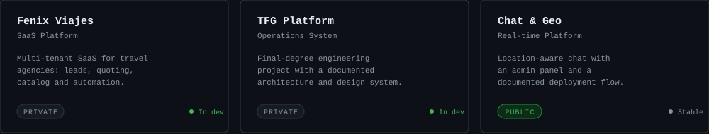
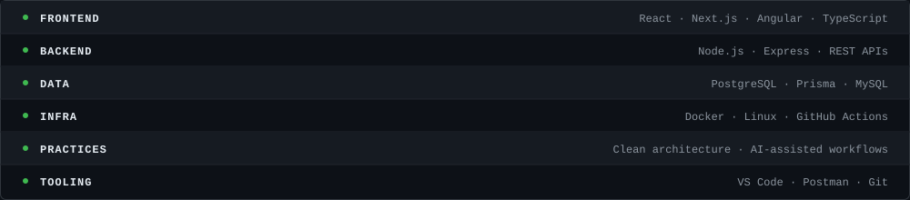
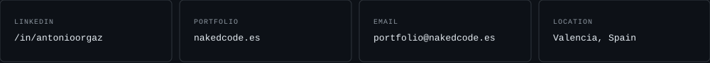

<div align="center">
  
</div>

<br/>

### `> whoami`

```
Full Stack Developer focused on backend systems, SaaS products
and clean architecture.

I turn ideas into production-ready software — and I use AI-assisted
engineering deliberately, as a force multiplier, not a shortcut.
```

<br/>

### `> currently-building`



<br/>

### `> selected-work`

Case studies below describe the engineering problem, decisions and stack — not implementation details, source code or business logic. Private projects are marked as such and are not linked.

<br/>

**Fenix Viajes — Multi-tenant SaaS for travel agencies** · `Private`
- **Problem:** travel agencies manage leads, quotes and bookings across disconnected spreadsheets and tools.
- **Approach:** a multi-tenant SaaS with a relational data model per agency, an automation layer for lead-to-quote workflows, and a reporting module.
- **Stack:** TypeScript · Node.js · Angular · PostgreSQL · Prisma.
- **Status:** active development.

**TFG — Operations Platform (Final Degree Project)** · `Private`
- **Problem:** academic capstone requiring a full-stack system evaluated on architecture, not just functionality.
- **Approach:** service-oriented backend with a documented data model, a dedicated design system, and UML-level architecture documentation produced alongside the code.
- **Stack:** TypeScript · Node.js · Prisma · PostgreSQL · Angular.
- **Status:** in development, pending final review.

**Real-time Chat & Geolocation Platform** · `Public`
- **Problem:** connect users in real time based on proximity, with an administrative layer for moderation.
- **Approach:** Symfony backend with a documented REST API, migrations-driven schema, and a deployment runbook.
- **Stack:** PHP · Symfony · MySQL.
- **Status:** maintained.

<br/>

### `> engineering-stack`



<br/>

### `> connect`

<a href="https://linkedin.com/in/antonioorgaz"></a>

<br/>

<div align="center">
  <sub>Code is not just what I write — it's how I solve problems.</sub>
</div>
